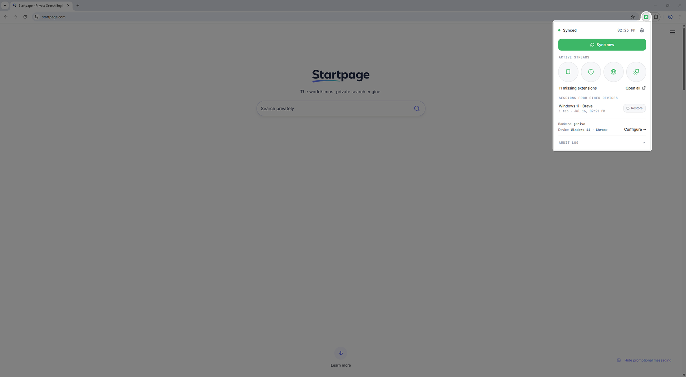

<p align="center">
  
</p>

<p align="center">
  <strong>Sync your browser to storage you own — no middleman, no account, no tracking.</strong>
</p>

<p align="center">
  Bookmarks · Open tabs · History · Extension list &nbsp;•&nbsp; Google Drive · GitHub · WebDAV &nbsp;•&nbsp; Optional end-to-end encryption
</p>

<p align="center">
  <a href="https://github.com/konabe-studio/konode/actions/workflows/ci.yml"></a>
  <a href="LICENSE"></a>
</p>

<p align="center">
  
</p>

---

Konode keeps your bookmarks, open tabs, history, and installed-extension list in sync
across your browsers — but instead of routing everything through a company's servers,
it writes to **storage you already own**: your Google Drive, a GitHub repository, or
any WebDAV server.

There's no Konode account to create and no Konode server to trust. Your data goes
straight from your browser to the place you picked, and your credentials never leave
your device. If you want, you can turn on end-to-end encryption so even your storage
provider can't read it.

## Why Konode

- **Your storage, your rules.** Pick Google Drive, GitHub, or WebDAV. Delete your data
  any time, straight from the provider.
- **No server, no telemetry.** Konode operates nothing in the middle. There's nothing
  to log, sell, or breach — because we never see your data.
- **Optional end-to-end encryption.** AES-256-GCM, chosen explicitly during setup. On
  or off, it's your call — nothing is silently uploaded behind a hidden default.
- **Works across browsers.** Any Chromium browser today; Firefox support is on the way.
- **Light by design.** No background bloat, no third-party scripts, no external
  requests beyond your own storage backend.

## What you can sync

| Data | What it does |
|------|--------------|
| **Bookmarks** | Two-way sync that preserves your folder structure. Deletions propagate too — no old bookmarks quietly coming back. |
| **Open tabs / sessions** | Save the current tab set and restore another device's session whenever you want. |
| **History** | Keep a synced, de-duplicated history list. *(Restore is best-effort — browsers can't set original visit times, so imported entries show the sync moment.)* |
| **Installed extensions** | Sync the list and see at a glance which extensions are missing on the device you're on. |

When two devices disagree, you choose how it's resolved — newest change wins, always
prefer this device, always prefer the other, or resolve it yourself from the popup.

## Where your data goes

| Backend | Auth | Notes |
|---------|------|-------|
| **Google Drive** | One-time sign-in | Scoped to `drive.file` — Konode only ever touches the files it creates. |
| **GitHub** | Fine-grained token | Point it at a single private repository. |
| **WebDAV** | Username + password | Nextcloud, ownCloud, Synology, pCloud, kDrive, or any WebDAV server. |
| **Mega** | — | Planned. |

## Privacy & security

- **No Konode servers exist.** Your data goes only to the backend you configure, and
  none of it is ever sent to us or to any third party.
- **Optional E2EE** (AES-256-GCM, PBKDF2-SHA256, 600k iterations): encrypt every
  payload before it leaves your browser. It's an explicit choice you make during
  onboarding — default off, never silently enabled or disabled.
- **Credentials stay local.** Access tokens, GitHub tokens, WebDAV passwords, and your
  encryption passphrase live only in `chrome.storage.local` on your device and are
  never uploaded. (That store isn't encrypted at rest, so a fine-grained GitHub token
  and a dedicated WebDAV app password are good habits.)
- **Integrity checks.** Every payload carries a SHA-256 checksum that's verified on
  download before anything is imported.
- **Least privilege.** `history`, `tabs`, and `management` are requested only when you
  turn those data types on. The extension-list permission is read-only — Konode never
  installs or removes anything.

## Browser support

- **Chromium** — Chrome, Brave, Helium, ungoogled-chromium, and other Chromium
  browsers. Fully supported.
- **Firefox** — supported through a dedicated build (currently in beta; a Firefox
  Add-ons listing is on the way).

> On non-Chrome Chromium browsers, Google Drive sign-in uses the OAuth PKCE flow
> (`launchWebAuthFlow`), so Drive sync works even where `chrome.identity.getAuthToken`
> isn't available.

## Install

Store listings (Chrome Web Store and Firefox Add-ons) are on the way. Until then, you
can build and load it yourself — see below. New to Konode? The
**[Getting Started guide](GETTING_STARTED.md)** walks through setup and connecting each
backend.

## Build from source

```bash
npm install          # install dependencies
npm run type-check   # tsc --noEmit — should be clean
npm run build        # → dist/           (Chromium)
npm run build:firefox # → dist-firefox/  (Firefox)
```

**Chromium:** open `chrome://extensions`, enable Developer mode, click **Load
unpacked**, and select `dist/`. After any rebuild, click ↻ reload on the extension
(MV3 won't swap a running service worker automatically).

**Firefox:** open `about:debugging` → **This Firefox** → **Load Temporary Add-on** and
pick `dist-firefox/manifest.json`.

> Building the Google Drive backend yourself requires your own Google OAuth client
> (scope `drive.file`). GitHub and WebDAV need no setup beyond your own credentials.

## Verifying a build

Each release publishes a **build fingerprint** — a deterministic SHA-256 over the
built `dist/`. To confirm a published build matches this source, check out the release
tag and run:

```bash
npm ci && npm run build && npm run checksum
```

Compare the printed `COMBINED` hash with the one in the release notes. (Best-effort: it
assumes a comparable toolchain; the pinned lockfile keeps dependencies identical.)

## How it works

For each device and data type, Konode writes one JSON file (a `SyncPacket`) to a
`Konode` folder on your backend. Every sync pulls in each peer device's file, merges it
non-destructively, and pushes the result back. Bookmarks use tombstones so deletions
travel between devices without resurrecting old entries, and a safety cap stops a
corrupt deletion log from wiping your tree.

When E2EE is on, the payload is encrypted on the device and the checksum is still
computed over the plaintext, so identical content matches across devices without
revealing anything to the backend.

## Why there's no password sync

Browser extensions **cannot** read the browser's native password store — that's an
intentional security boundary in the browser, not a Konode limitation. For passwords,
use a dedicated manager like [Bitwarden](https://bitwarden.com),
[Proton Pass](https://proton.me/pass), or self-hosted
[Vaultwarden](https://github.com/dani-garcia/vaultwarden).

## Roadmap

- **Shipped** — bookmarks / sessions / history / extension-list sync · Google Drive +
  GitHub + WebDAV · multi-device merge · per-item conflict resolution · opt-in E2EE ·
  Drive OAuth refresh (PKCE) · Firefox build.
- **Next** — Chrome Web Store & Firefox Add-ons listings · folder/position sync ·
  WebDAV provider presets.
- **Later** — more backends (Dropbox, OneDrive, Mega) · incremental diff for very
  large bookmark trees.

## Support & feedback

Something not working? Check **[Troubleshooting](TROUBLESHOOTING.md)** first. Still
stuck, or have an idea? **Open an issue** — it's the best way to reach us:
[github.com/konabe-studio/konode/issues](https://github.com/konabe-studio/konode/issues).

If Konode is useful to you and you'd like to support its development, you can
[buy me a coffee](https://buymeacoffee.com/konabe.studio). Entirely optional — Konode
is free and open source.

## License

See [LICENSE](LICENSE).

---

<p align="center"><sub>Konode is not affiliated with Google, GitHub, Mozilla, or any storage provider.</sub></p>
