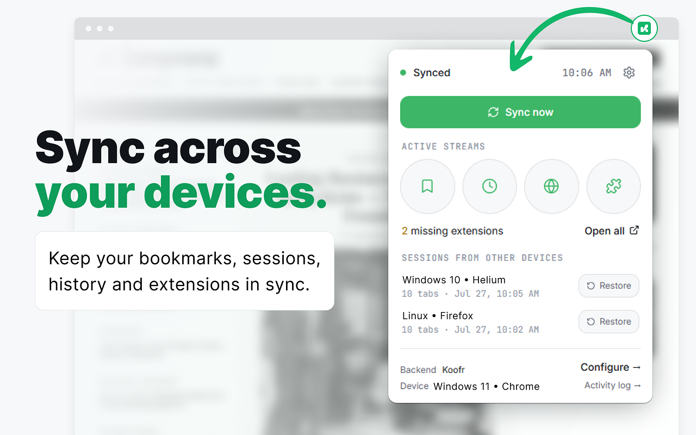

<p align="center">
  
</p>

<p align="center">
  <strong>Sync your browser to storage you own: no middleman, no account, no tracking.</strong>
</p>

<p align="center">
  Bookmarks · Open tabs · History · Extension list &nbsp;•&nbsp; Google Drive · GitHub · WebDAV &nbsp;•&nbsp; Optional end-to-end encryption
</p>

<p align="center">
  <a href="https://chromewebstore.google.com/detail/konode/mmlfiiimnpnjcjhhbldenpcmnibedkfa"></a>
  <a href="https://addons.mozilla.org/firefox/addon/konode/"></a>
  <a href="https://github.com/konabe-studio/konode/actions/workflows/ci.yml"></a>
  <a href="LICENSE"></a>
</p>

<p align="center">
  
</p>

---

Konode keeps your bookmarks, open tabs, history, and installed-extension list in sync
across your browsers, but instead of routing everything through a company's servers,
it writes to **storage you already own**: your Google Drive, a GitHub repository, or
any WebDAV server.

There's no Konode account to create and no Konode server to trust. Your data goes
straight from your browser to the place you picked, and your credentials never leave
your device. If you want, you can turn on end-to-end encryption so even your storage
provider can't read it.

## Why Konode

- **Your storage, your rules.** Pick Google Drive, GitHub, or WebDAV. Delete your data
  any time, straight from the provider.
- **No server, no telemetry.** Konode operates nothing in the middle. There's nothing
  to log, sell, or breach, because we never see your data.
- **Optional end-to-end encryption.** AES-256-GCM, chosen explicitly during setup. On
  or off, it's your call. Nothing is silently uploaded behind a hidden default.
- **Works across browsers.** Any Chromium browser, plus Firefox and Firefox-based browsers.
- **Light by design.** No background bloat, no third-party scripts, no external
  requests beyond your own storage backend.

## What you can sync

| Data | What it does |
|------|--------------|
| **Bookmarks** | Two-way sync that preserves your folder structure. Renames, moves and folder reorders travel too, and so do deletions, so no old bookmarks quietly come back. |
| **Open tabs / sessions** | Save the current tab set and restore another device's session whenever you want. |
| **History** | Keep a synced, de-duplicated history list. *(On Firefox the original visit time is preserved; on Chrome the API can't set visit times, so restored entries show the sync moment.)* |
| **Installed extensions** | Sync the list and see at a glance which extensions are missing on the device you're on. |

When two devices disagree, you choose how it's resolved: newest change wins, always
prefer this device, always prefer the other, or resolve it yourself from the popup.

## Where your data goes

| Backend | Auth | Notes |
|---------|------|-------|
| **Google Drive** | One-time sign-in | Scoped to `drive.file`, so Konode only ever touches the files it creates. |
| **GitHub** | Fine-grained token | Point it at a single private repository. |
| **WebDAV** | Username + password | Presets fill in the address for Nextcloud / ownCloud, pCloud, Koofr, and Fastmail. **WebDAV (other)** takes Synology, kDrive, or any standard WebDAV server. |
| **Mega** | n/a | Planned. |

## How Konode compares

Every tool below is good at what it does. They just make different choices about where
your data ends up, which is the one thing this table is about. Checked August 2026.

| | **Konode** | floccus | xBrowserSync | Built-in sync |
|---|---|---|---|---|
| **What syncs** | **Bookmarks, tabs, history, extension list** | Bookmarks, or open tabs | Bookmarks | Bookmarks, tabs, history, passwords, and more |
| **Where synced data is stored** | **Your Drive, GitHub, or WebDAV** | Nextcloud, WebDAV, Git, Drive, Dropbox, Linkwarden, KaraKeep | Its own service: official, community-run, or self-hosted | Google's or Mozilla's servers |
| **Account needed** | **No Konode account** | No floccus account | No account, just a sync ID and password | Yes, a Google or Mozilla account |
| **End-to-end encryption** | **Optional, on every backend** | Optional, on WebDAV and Drive | Always on | Firefox by default, Chrome behind a passphrase |
| **Open source** | **Yes, MPL-2.0** | Yes, MPL-2.0 | Yes, GPL-3.0 | Clients open. Firefox's server too, Chrome's not |

A few details the cells are too small for. floccus syncs open tabs as an alternative to
bookmarks inside one sync profile, so doing both means setting up a second profile.
Chrome's built-in sync encrypts passwords by default and the rest once you set a sync
passphrase, with some categories left out; Firefox Sync is end-to-end encrypted by
default.

## Privacy & security

- **No Konode servers exist.** Your data goes only to the backend you configure, and
  none of it is ever sent to us or to any third party.
- **Optional E2EE** (AES-256-GCM, PBKDF2-SHA256, 600k iterations): encrypt every
  payload before it leaves your browser. It's an explicit choice you make during
  onboarding. Default off, never silently enabled or disabled. Honest threat model:
  encrypted files sit on storage others can read, so a passphrase is guessable
  *offline*. The 600k-round derivation makes each guess slow, a new passphrase must
  be 12+ characters, and the generated key (recommended) is effectively unguessable.
- **Credentials stay local.** Access tokens, GitHub tokens, WebDAV passwords, and your
  encryption passphrase live only in the browser's own extension storage
  (`storage.local`) on your device and are
  never uploaded. (That store isn't encrypted at rest, so a fine-grained GitHub token
  and a dedicated WebDAV app password are good habits.)
- **Integrity checks.** Every payload carries a SHA-256 checksum that's verified on
  download before anything is imported.
- **Least privilege.** `history`, `tabs`, and `management` are requested only when you
  turn those data types on. The extension-list permission is read-only: Konode never
  installs or removes anything.

## Browser support

- **Chromium**: Chrome, Brave, Helium, ungoogled-chromium, and other Chromium
  browsers. Fully supported, and on the Chrome Web Store.
- **Firefox**: Firefox and Firefox-based browsers (e.g. Waterfox), from a dedicated
  build that ships on Firefox Add-ons. Same sync folder and same files as your
  Chromium browsers, so a Firefox install joins a group that is already running.

> On non-Chrome Chromium browsers, Google Drive sign-in uses the OAuth PKCE flow
> (`launchWebAuthFlow`), so Drive sync works even where `chrome.identity.getAuthToken`
> isn't available.

## Translations

Konode speaks **English, Hungarian, German, Spanish and Chinese (Simplified)**, and
follows your browser's language. Every screen is translated: the popup, the setup wizard,
and Settings. Dates and numbers follow your browser's locale everywhere.

**Japanese**, **Italian** and **Estonian** have been started. A language reaches a release
once it is complete, because a screen that is half translated reads worse than an English
one.

Translations are edited on
[Hosted Weblate](https://hosted.weblate.org/projects/konode/). You don't need git, a
pull request, or any knowledge of the code to help. If your language is missing, ask
for it there and it will appear. The strings themselves live in this repository, under
`public/_locales/<lang>/messages.json`.

About half the strings carry a note explaining what they are and why they are worded the
way they are; a few of them make promises about not losing your data, and those have to be
translated literally. If a string's meaning isn't clear, leave it and ask. An
untranslated string falls back to English, which is safe.

## Install

- **Chrome / Brave / Helium / other Chromium browsers**: install from the
  **[Chrome Web Store](https://chromewebstore.google.com/detail/konode/mmlfiiimnpnjcjhhbldenpcmnibedkfa)**.
- **Firefox / Waterfox**: install from
  **[Firefox Add-ons](https://addons.mozilla.org/firefox/addon/konode/)**.

New to Konode? The **[Getting Started guide](GETTING_STARTED.md)** walks through setup
and connecting each backend.

## Build from source

```bash
npm install          # install dependencies
npm run type-check   # tsc --noEmit, should be clean
npm run build        # → dist/           (Chromium)
npm run build:firefox # → dist-firefox/  (Firefox)
```

**Chromium:** open `chrome://extensions`, enable Developer mode, click **Load
unpacked**, and select `dist/`. After any rebuild, click ↻ reload on the extension
(MV3 won't swap a running service worker automatically).

**Firefox:** open `about:debugging` → **This Firefox** → **Load Temporary Add-on** and
pick `dist-firefox/manifest.json`.

> Building the Google Drive backend yourself requires your own Google OAuth client
> (scope `drive.file`). GitHub and WebDAV need no setup beyond your own credentials.

## Verifying a build

`npm run checksum` prints a **build fingerprint**, a deterministic SHA-256 over the built
`dist/`. Check out a release tag and run:

```bash
npm ci && npm run build && npm run checksum
```

Two honest caveats. The release notes don't carry the fingerprint yet, so today this shows
you that the build reproduces, not that a particular download came from this tag. (GitHub
does publish its own SHA-256 digest next to each release asset, which covers the download
itself.) And the store builds can't match your hash: the Chrome Web Store and Firefox
Add-ons zips are built with Konode's own Google OAuth client compiled in, while the release
zips and your own builds are not. It also assumes a comparable toolchain; the pinned
lockfile keeps dependencies identical.

## How it works

For each device and data type, Konode writes one JSON file (a `SyncPacket`) to a
`Konode` folder on your backend. Every sync pulls in each peer device's file, merges it
non-destructively, and pushes the result back. Bookmarks use tombstones so deletions
travel between devices without resurrecting old entries, and a safety cap stops a
corrupt deletion log from wiping your tree.

When E2EE is on, the payload is encrypted on the device and the checksum is still
computed over the plaintext, so identical content matches across devices without
revealing anything to the backend.

## Why there's no password sync

Browser extensions **cannot** read the browser's native password store. That's an
intentional security boundary in the browser, not a Konode limitation. For passwords,
use a dedicated manager like [Bitwarden](https://bitwarden.com),
[Proton Pass](https://proton.me/pass), or self-hosted
[Vaultwarden](https://github.com/dani-garcia/vaultwarden).

## Roadmap

- **Shipped**: bookmarks / sessions / history / extension-list sync · Google Drive +
  GitHub + WebDAV · WebDAV provider presets · multi-device merge · per-item conflict
  resolution · opt-in E2EE · Drive OAuth refresh (PKCE) · cross-browser extension
  matching · **Chrome Web Store listing** · **Firefox Add-ons listing** · **translated
  interface** (English, Hungarian, German, Spanish, Chinese (Simplified)).
- **Next**: more backends, cheapest sign-in first (Dropbox token and S3-compatible, then
  Dropbox OAuth and OneDrive) · faster history sync · more languages (Japanese, Italian,
  Estonian).
- **Later**: MEGA · incremental diff for very large bookmark trees · diffs between
  restore points.

## Support & feedback

Something not working? Check **[Troubleshooting](TROUBLESHOOTING.md)** first. Still
stuck, or have an idea? **Open an issue**. It's the best way to reach us:
[github.com/konabe-studio/konode/issues](https://github.com/konabe-studio/konode/issues).

If Konode is useful to you and you'd like to support its development, you can
[buy me a coffee](https://buymeacoffee.com/konabe.studio). Entirely optional. Konode
is free and open source.

## License

See [LICENSE](LICENSE).

## Built with

Built with AI assistance (Claude Code), human-reviewed and maintained by Kōnabe Studio.

---

<p align="center"><sub>Konode is not affiliated with Google, GitHub, Mozilla, or any storage provider.</sub></p>
